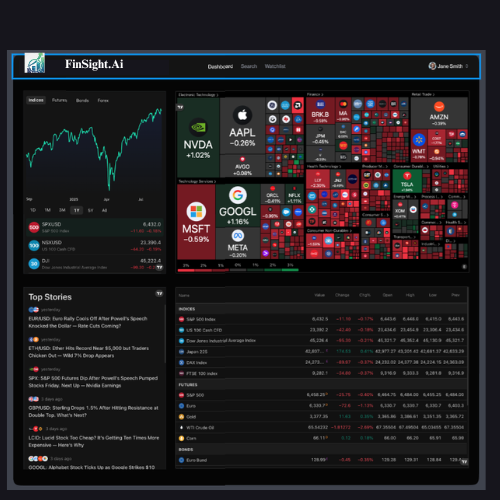
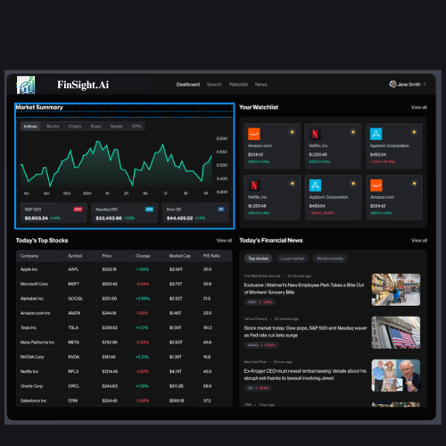
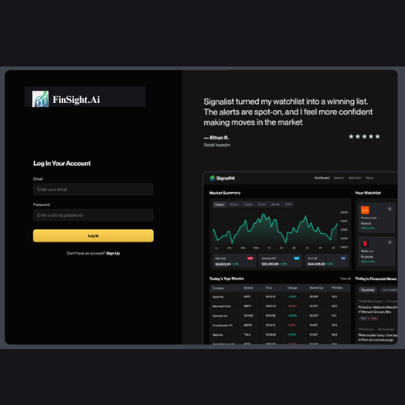
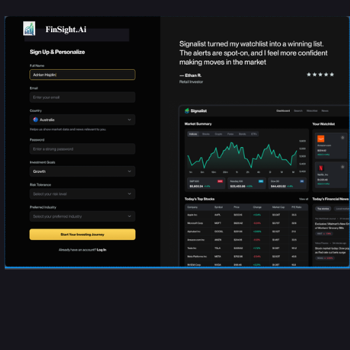
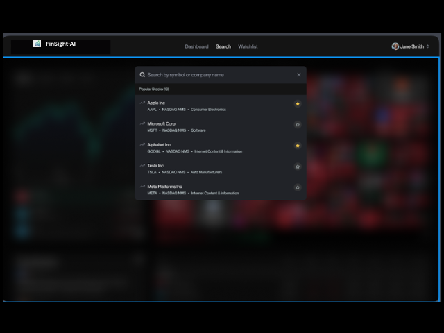
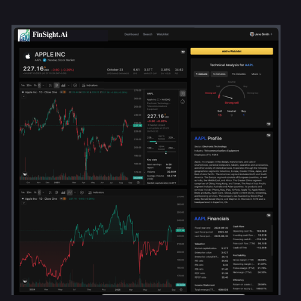
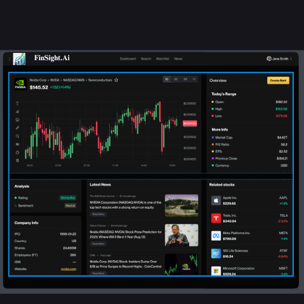
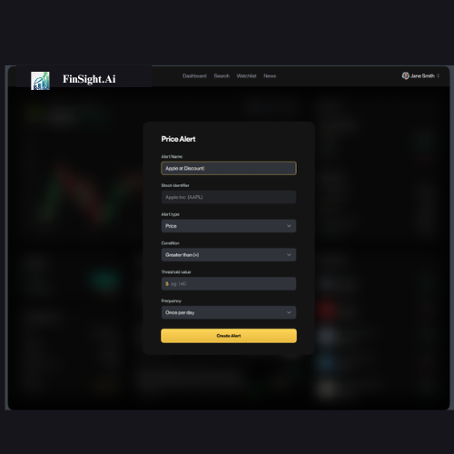
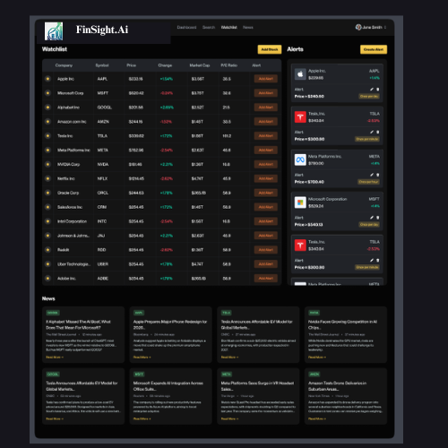

# 📈 FinSight AI – Real-Time Stock Market Tracker

FinSight AI is a full-featured real-time stock market tracking application built with **Next.js**, **Shadcn UI**, **MongoDB**, **TradingView Widgets**, and **Inngest** for background jobs like AI-generated summaries and email alerts.  
The app delivers live stock data, personalized alerts, AI-powered insights, secure authentication, and a clean professional dashboard UI.

---

## 🚀 Features

### 🔹 **Core Stock Features**
- Real-time stock price streaming  
- Interactive candlestick charts  
- TradingView Widgets (4 types)  
- Stock search with debouncing  
- Detailed stock page  
- Watchlist with saved stocks  
- Filter & smart sorting options  

### 🔹 **Authentication**
- Secure login & signup  
- Session management  
- Password hashing  
- Auth middleware (protected pages)  
- Email verification  

### 🔹 **AI-Powered Insights**
- AI-generated welcome email  
- AI-generated stock insights  
- AI-generated daily market summary  
- Personalized news based on user’s watchlist  

### 🔹 **Notifications & Jobs**
- Email alerts for stock updates  
- Background workflows using **Inngest**  
- Daily personalized news via email  
- Error handling & fail-fast logic  

### 🔹 **Tech Stack**
- **Next.js 14**
- **TailwindCSS**
- **Shadcn UI**
- **MongoDB + Mongoose**
- **Inngest**
- **TradingView Widgets**
- **React Hook Form**
- **NodeMailer**
- **FinHub API**

---

## 📁 Folder Structure

FinSight-AI/

├── app/

│ ├── (auth)/ # Login, SignUp

│ ├── dashboard/ # Main dashboard UI

│ ├── stocks/ # Stock detail pages

│ ├── api/ # API routes

│ └── layout.tsx

│

├── components/

│ ├── ui/ # Shadcn components

│ ├── forms/ # Reusable form components

│ └── charts/ # TradingView widgets

│

├── lib/

│ ├── db.ts # MongoDB config

│ ├── inngest.ts # Inngest workflows

│ └── mailer.ts # NodeMailer setup

│

├── utils/

│ ├── validate.ts

│ ├── formatDate.ts

│ └── fetchStock.ts

│

├── types/

│ ├── user.types.ts

│ ├── stock.types.ts

│ └── news.types.ts

│

├── public/

│

├── screenshots/

│ ├── homepage.png

│ ├── dashboard1.png

│ ├── interview-confirmation.png

│ └── workflow-page.png

│

├── .env.local

├── tailwind.config.js

├── package.json

└── README.md

---

## 🛠️ Installation

### 1️⃣ Clone the repository  

git clone https://github.com/shraddha524/FinSight AI.git

cd FinSight AI

------

**2️⃣ Install dependencies**

npm install

------

**3️⃣ Run the development server**

npm run dev

----

**🔐 Environment Variables**

Create a .env.local file:

MONGODB_URI=your_mongodb_url

NEXT_PUBLIC_FH_API_KEY=your_finhub_key

INGGEST_API_KEY=your_Inngest_key

MAIL_HOST=smtp.gmail.com

MAIL_PORT=587

MAIL_USER=your_email

MAIL_PASS=your_email_password

NEXTAUTH_SECRET=your_long_secret

---

**🖼️ Screenshots**

## 📸 Screenshots

### 📊 Dashboard

### 🔐 Authentication

### 🔍 Search

### 📈 Stock Details

### 🔔 Price Alert Modal

### ⭐ Watchlist Alerts

